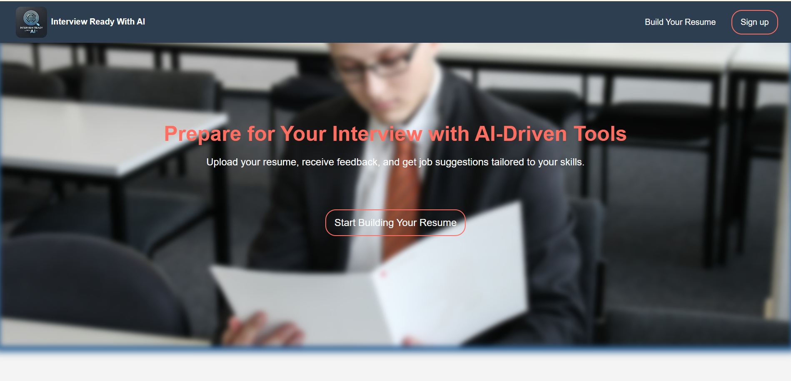
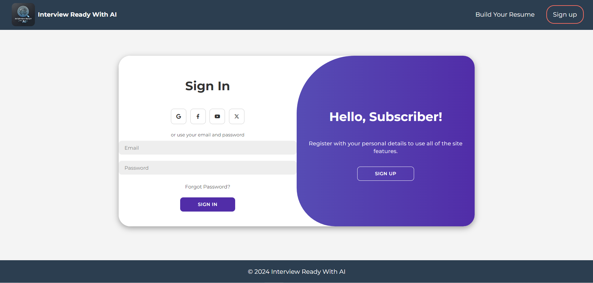
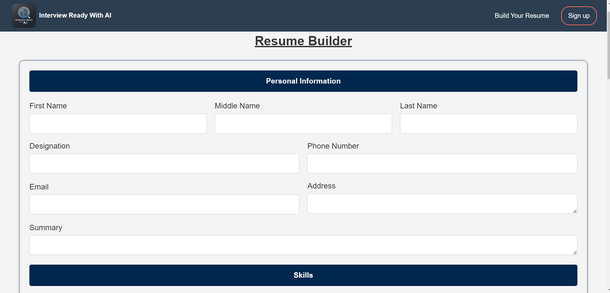
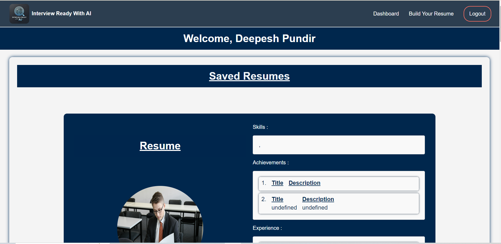

# Interview Ready With AI

## Project Overview
**Interview Ready With AI** is an interactive platform designed to help users prepare for job interviews. The platform offers resume analysis, job suggestions, personalized project recommendations, and AI-driven mock interviews to enhance a user's interview readiness. It leverages AI and integrates with external job databases to deliver a tailored experience based on user data.

## Project Images

### 1. Home Page


### 2. Login Page


### 2. Resume Builder


### 3. User Dashboard

## Features

### 1. Resume Builder
- **Home Page**: Features a clean interface where users can register, authenticate, and manage their profiles.
- **Resume Creation**: Allows users to create, print, and download their resumes in PDF format.
- **Resume Feedback**: Provides feedback on resumes, helping users improve the quality and presentation of their content.

### 2. Job Suggestions Based on Resume
- **Job Matching**: Suggests job openings that align with the user's resume, skills, and experience.
- **External API Integration**: Utilizes APIs like the Indeed Job Search API to fetch job listings based on the user's resume content.

### 3. Project Recommendations
- **Personalized Projects**: Recommends open-source projects, tutorials, and initiatives based on the user's skill set and career goals.
- **API Integration**: Fetches project recommendations from platforms like GitHub through its API, guiding users to relevant opportunities to enhance their skills.

## Technologies Used

### Frontend:
- **HTML**
- **CSS**
- **JavaScript**

### APIs:
- **Adzuna API**: To fetch relevant job listings based on the user's resume.
- **GitHub API**: To recommend open-source projects and tutorials for skill enhancement.

## Future Improvements
- Expand integration to include additional job and project databases.
- Improve AI-driven interview simulation with deeper question analysis and feedback.
- Incorporate real-time progress tracking and suggestions based on user activity.

## Setup & Installation
1. Clone the repository:
   ```bash
   git clone https://github.com/your-username/interview-ready-with-ai.git
